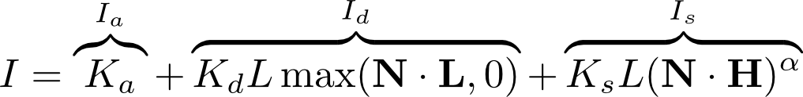
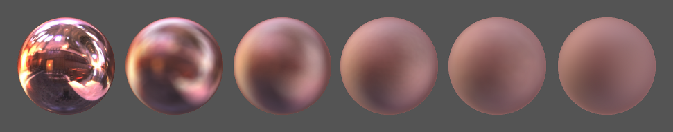

# Assignment 3 - Lighting, texturing, and shadows (1TD388/1MD150)

We will now improve the lighting from the previous assignment, by introducing the normalized Blinn-Phong shading model and replacing per-vertex lighting calculations with per-fragment calculations. You will also add image-based lighting (environment mapping) and shadows to the scene, and load textured models.

For parts 3 and 4 of this exercise, you need to update some files of the glTF viewer, since the latest version on https://github.com/cg-uu/gltf_viewer provides code for reading material textures and creating depth framebuffers for shadow maps. If you cloned the repo earlier, you could just pull the changes (make sure you take a backup of `model_viewer.cpp` first, so that you do not accidentaly overwrite anything you did in assignment 2!). Otherwise, download the latest version as a zip-file and copy the files `cg_utils.h/cpp, gltf_io.h/cpp, gltf_scene.h/cpp, and gltf_render.h/cpp` to the `src` folder.

The deadline for the assignment and further instructions about what parts and files you need hand in to pass are available on the course page in Studium.

## Part 1 - Normalized Blinn-Phong shading

### Per-fragment shading

In the last assignment, we implemented the standard Blinn-Phong shading model

in the vertex shader (`mesh.vert`), such that the lighting calculations were performed per-vertex and the resulting color values were interpolated in the fragment shader. While this works OK for diffuse surfaces, one limitation is that for example sharp specular reflections are not preserved. By instead passing interpolated input vectors to the fragment shader, and performing the calculations per-fragment, we will see a clear difference on shiny surfaces, with specular highlights being more accurate!

### Normalization factor

One problem with the standard Blinn-Phong shading model is that it is unnormalized. A normalized shading model should increase the intensity of the specular highlight as the highlight gets narrower, so that the total outgoing energy remains constant with varying smoothness (specular power). If we use the standard unnormalized Blinn-Phong shading model the result might look like this,

i.e., the specular highlight remains equally bright as it gets narrower, which is unrealistic and leads to loss of energy. We could try to tweak the intensity of the specular color Ks until the result looks good, but that solution does not scale well when we add more light sources and materials. By instead applying a normalization factor, like so,

we can make the Blinn-Phong shading model normalized and obtain a more consistent and realistic shading result!

### Gamma correction

The lighting calculations we perform assumes that we are working in linear RGB color space, where, for example, the color (0.5, 0.0, 0.0) should be half as bright as the color (1.0, 0.0, 0.0). However, as mentioned in the lectures, CRT or LCD monitors have a non-linear response, so when you display the color (0.5, 0.0, 0.0) it will appear only ~21% as bright as (1.0, 0.0, 0.0), i.e., darker than expected. See [here](http://www.geeks3d.com/20101001/tutorial-gamma-correction-a-story-of-linearity/) for more details. The following graph (obtained from Wikipedia) shows the non-linear response pow(2.2) of a CRT monitor and how we can correct it by applying the inverse function pow(1/2.2) on the RGB color that we want to display.

To apply gamma correction in GLSL, we just set the output color of the lighting calculations to

    output_color = pow(output_color, vec3(1 / 2.2));

before assigning it to frag_color. The following image shows an example of Blinn-Phong shading with and without gamma correction:

### Your tasks for this part

- Calculate (in the vertex shader) the view-space normal N, the view-space light vector L, and the view vector V (simply the negative of the view-space position) and pass them as varying vec3 variables to the fragment shader.
- Implement the normalized Blinn-Phong shading model in the fragment shader.
- Apply gamma correction (and make it possible toggle via the GUI).

As a rule of thumb, the specular color Ks for plastic and other non-metallic materials should be monochrome and have fairly low intensity, e.g., vec3(0.04). The ambient color Ka can be set to a small multiple (try 0.01-0.1) of the diffuse color Kd.

 
## Part 2 - Image-based lighting (environment mapping)

A cube map is a type of texture that stores the incoming light from the environment in the six sides of a cube centered at the camera position. It can be used to create reflection (and refraction!) effects, as illustrated in the image above. This technique is commonly used to apply image-based lighting to a scene.

To render a reflective surface, we compute (in the fragment shader) the surface's reflection vector and use it as a 3D texture coordinate to fetch the incoming light as an RGB color value from the cube map. In GLSL, the reflection vector R can be computed from the normal vector N and the view vector V as

    vec3 R = reflect(-V, N);

See the documentation of the [`reflect()`](https://www.opengl.org/sdk/docs/man4/html/reflect.xhtml) function for more details.

Standard environment mapping produces perfectly smooth, mirror-like surfaces. By pre-filtering the cube map with a smoothing filter based on the specular power of the Blinn-Phong shading model , we can also simulate surfaces with different glossiness/roughness:

The cube maps folder contains several sets of cube maps, both the original unfiltered cube maps (most of them obtained from http://www.humus.name/index.php?page=Textures) and pre-filtered low-resolution versions. The subdirectory names 0.125, 0.5, 2, 8, 32, 128, 512 and 2048 specify which specular power each of the pre-filtered cube maps corresponds to.

You can use `load_cubemap()` to load a cube map from a directory, like this 

    ctx.cubemap = cg::load_cubemap(cubemap_dir() + "/RomeChurch/");

More cube maps can be found in the `assets/cubemap` folder of the model viewer. You should define the function `cubemap_dir()` similar to existing functions like `shader_dir()`, etc.

### Your tasks for this part

- Extend your viewer so that it loads a single cubemap image.
- In the draw function, select the active texture unit with `glActiveTexture()`, bind the cubemap texture to `GL_TEXTURE_CUBE_MAP` with `glBindTexture()`, and pass the number of the active texture unit (e.g., 0 for `GL_TEXTURE0`) as a uniform `int` variable (call it for example `u_cubemap`) to the shader program.
- Implement reflective environment mapping in the fragment shader. You need to compute the reflection vector and use it to fetch the incoming light from the cube map texture.* You should also make it possible to toggle the environment mapping on/off via the GUI.
- When the basic environment mapping seems to work, load the pre-filtered cubemaps (corresponding to the specular powers 0.125, 0.5, 2, 8, 32, 128, 512, and 2048) from one of the provided cubemap sets into separate textures and add a slider (or some other GUI component) for switching between the textures, so that you can change the appearance of the surface from rough to shiny.
- Hint: you can store the texture IDs in a `std::vector` or in a standard array and define a variable (in the Context struct) that represents the index of the active texture.

*In GLSL, a cube map texture is called "samplerCube". You need to declare the u_cubemap variable as

    uniform samplerCube u_cubemap;

in the fragment shader and then, in the main() function, perform the texture lookup (with the reflection vector R) as

    vec3 color = texture(u_cubemap, R).rgb;

## Part 3 - Texture mapping

The glTF format supports materials with textures for different material properties (base color, roughness, metallicness, etc.). In this part, we will add texture mapping to the viewer, and use these textures as additional input to the Blinn-Phong shading model when computing the lighting.

A scene that has texture data (base color and bump map) is provided in the folder `assets/gltf` with this assignment. Copy the files of this folder to the corresponding folder in your model viewer, and load `lpshead.gltf` to look at the non-textured mesh.

Enable the attribute for the first texture coordinate (`a_texcoord_0`), and try visualizing this coordinate in the fragment shader. The glTF format actually supports multiple texture coordinates per vertex, but for this assignment, you can assume that only the first one is used.

2D images for material textures are automatically loaded with the scene. To create texture objects for these images, you need to add a list for the texture objects to the Context struct,

    struct Context {
        // ...
        gltf::TextureList textures;
        // ...
    };

and call the following function after the scene has been loaded:

    gltf::create_textures_from_gltf_asset(ctx.textures, ctx.asset);

Information about what material textures a mesh is using is stored in the `gltf::Material` and `gltf::PBRMetallicRoughness` structs, which together define a material. Here is some example code how to access these structs per-object (or per-node) during rendering:

    const gltf::Mesh &mesh = ctx.asset.meshes[node.mesh];
    if (mesh.primitives[0].hasMaterial) {
        const gltf::Primitive &primitive = mesh.primitives[0];
        const gltf::Material &material = ctx.asset.materials[primitive.material];
        const gltf::PBRMetallicRoughness &pbr = material.pbrMetallicRoughness;

        // Define material textures and uniforms
        // ...
    }

Similar to in the environment mapping in part 2, you need to bind texture objects to texture units, and define sampler uniforms for these. Note that material textures are just 2D images, so here we need to bind the textures to `GL_TEXTURE_2D` and use the `sampler2D` uniform type. You can get a texture ID from the material like this:

    if (pbr.hasBaseColorTexture) {
        GLuint texture_id = ctx.textures[pbr.baseColorTexture.index];
        // Bind texture and define uniforms...
    } else {
        // Need to handle this case as well, by telling
        // the shader that no texture is available
    }

### Your tasks for this part

- Make it possible to visualize the texture coordinates of a mesh, by adding a checkbox for this in the GUI.
- Add support for texture mapping in the viewer. When texture mapping is enabled and the model has texture data, it should be possible to obtain the material diffuse color from the base color texture when computing the lighting with normalized Blinn-Phong shading.
- (Optional) Try implementing bump mapping using the material normal texture of `lpshead.gltf`. In one of the lectures from the course, you can find GLSL code for computing a tangent space in the fragment shader, which may be useful.
- In addition, every other feature from parts 1 and 2 of this assignment must still be included in the final viewer for part 3.

## Part 4 - Shadow mapping (only for 1TD388)

In this final part, you will implement the technique [shadow mapping](https://en.wikipedia.org/wiki/Shadow_mapping) to allow the point light source in your model viewer to cast shadows on the rendered scene. Some sample code and more detailed instructions for this part are found [here](part4/README.md).

### Your tasks for this part

- Follow these [instructions](part4/README.md) and implement shadow mapping in the model viewer. If you have more than one point light source, only one of them need to be shadow casting and have a shadow map.
- Extend the GUI so that it is possible to toggle shadow mapping on/off, change the position of the light source, and change the shadow bias parameter. For debugging, it can also be useful to have a checkbox for showing a depth visualization of the scene from the light's viewpoint (like in the left image above)
