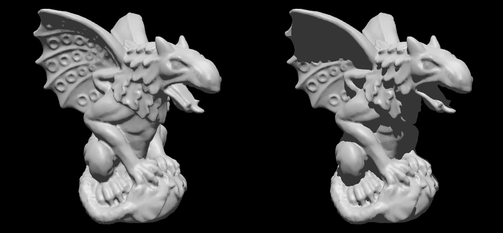
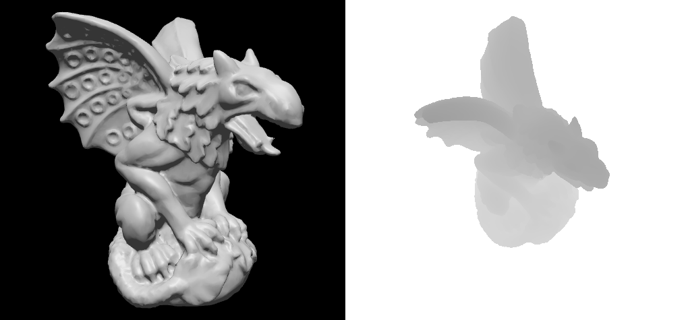
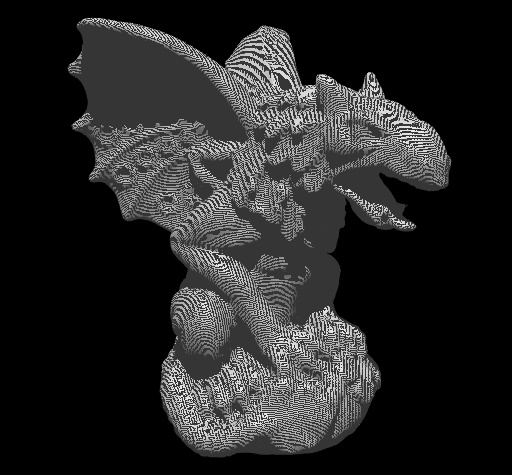
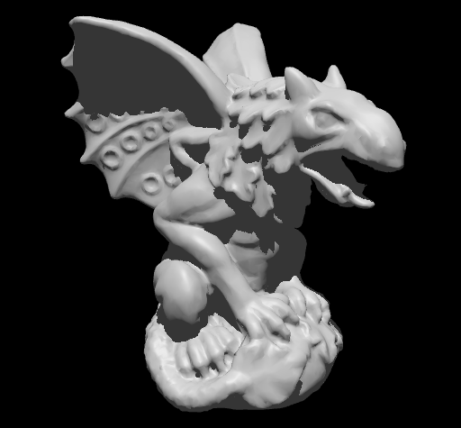

# Part 4 - Shadow mapping (1TD388)



In this part of assignment 3, you will get some code that you can use as starting point for implementing basic shadow mapping. The folder `part4` contains the files `sample_code.cpp`, `shadow.vert`, and `shadow.frag`: paste the code from the first file into your `model_viewer.cpp`, and copy the other two files to the `src/shader` directory. 

For an introduction to how shadow mapping works, see for example this [article](https://en.wikipedia.org/wiki/Shadow_mapping) on Wikipedia.

## Basic steps

After you have copied the code from `sample_code.cpp` to `model_viewer.cpp`, add the following items to your Context struct:

```
struct Context {
    // ...

    ShadowCastingLight light;
    GLuint shadowProgram;
    bool showShadowmap = false;

    // ...
};
```

Before we can generate a shadowmap, we need to create a depth 2D texture (in this case a 512x512 texture) for storing the shadowmap, and a framebuffer object and shader program for rendering the scene to this depth texture, like this

```
void do_initialization(Context &ctx)
{
    // ...

    ctx.shadowProgram =
        cg::load_shader_program(shader_dir() + "shadow.vert", shader_dir() + "shadow.frag");

    ctx.light.shadowmap = cg::create_depth_texture(512, 512);
    ctx.light.shadowFBO = cg::create_depth_framebuffer(ctx.light.shadowmap);

    // ...
}
```

If you look at the `ShadowCastingLight` struct,

```
struct ShadowCastingLight {
    glm::vec3 position;      // Light source position
    glm::mat4 shadowMatrix;  // Camera matrix for shadowmap
    GLuint shadowmap;        // Depth texture
    GLuint shadowFBO;        // Depth framebuffer
    float shadowBias;        // Bias for depth comparison
}; 
```

you see that there are some additional items in the struct that you might want to initialize. It is easiest if you define the light source position in world space; if you have it defined in some other space, for example in view space, you still have to transform it to world space later when you render the scene to the shadowmap and update the shadow matrix. The shadow bias can initially be set to 0, and the shadow matrix will be updated each frame, so you can just set it to the identity matrix.

The next step is to change your main rendering function, so that the shadow map is updated before the scene is rendered with lighting:

```
void do_rendering(Context &ctx)
{
    // ...

    update_shadowmap(ctx, ctx.light, ctx.light.shadowFBO);
    draw_scene(ctx);

    if (ctx.showShadowmap) {
        // Draw shadowmap on default screen framebuffer
        glClearColor(1.0f, 1.0f, 1.0f, 1.0f);
        glClear(GL_COLOR_BUFFER_BIT); 
        update_shadowmap(ctx, ctx.light, 0);
    }

    // ...
}
```

After these steps, you now have to modify the function `update_shadowmap()` to set up a separate camera (view and projection matrices) for rendering the scene from the light source's viewpoint. The camera should point towards the model, and the frustum must cover the parts of the scene that should recieve shadows. To verify that your shadow matrix seems correct, you can add a GUI checkbox for the flag `ctx.showShadowmap` to visualize the shadowmap. The following figure shows the lit gargoyle model without shadows, and a depth image that corresponds to the shadowmap. If your visualization only shows white, try experimenting with adjusting the field-of-view and far-plane distance of the perspective projection matrix. 



In `draw_scene()` and in the fragment shader where you compute the Blinn-Phong lighting (`mesh.frag`), you need to add a `sampler2D` uniform for the shadowmap texture, and define another uniform `u_shadowFromView` for transforming the view position in the fragment shader first to world space and then to clip space of the shadowmap's camera. When you compute the lighting, you can use the following GLSL function to perform the depth comparison that shadow mapping uses to determine if a point on the surface is visible or not:

```
float shadowmap_visibility(sampler2D shadowmap, vec4 shadowPos, float bias)
{
    vec2 delta = vec2(0.5) / textureSize(shadowmap, 0).xy;
    vec2 texcoord = (shadowPos.xy / shadowPos.w) * 0.5 + 0.5;
    float depth = (shadowPos.z / shadowPos.w) * 0.5 + 0.5;
    
    // Sample the shadowmap and compare texels with (depth - bias) to
    // return a visibility value in range [0, 1]. If you take more
    // samples (using delta to offset the texture coordinate), the
    // returned value should be the average of all comparisons.
    float texel = texture(shadowmap, texcoord).r;
    float visibility = float(texel > depth - bias);
    return visibility;
}
```

The returned visibility value (a value between 0 and 1) should finally be multiplied with the light intensity (or alternatively, the light color) when you compute the diffuse and specular lighting terms for the light source in the Blinn-Phong model.


## Shadow artifacts

If you have implemented everything correctly so far, you should see some shadows but probably also a lot of artifacts in the rendered image. The first one you probably will notice is "shadow acne", which looks like this:



Because of limited depth precision, a surface point that should be visible can still fail the depth comparison with values in the shadowmap. A way to fix this is to apply a small bias term to "push" the point's depth value away from the surface. This is what the shadows from the same 512x512 shadowmap looks like with a small non-zero bias:


The other artifact you probably will notice is aliasing from limited resolution of the shadowmap. You can try increasing the shadowmap resolution from 512x512 to some other value, which should improve the shadow quality:



While increasing the resolution reduces aliasing and improves the sharpness of the edges of the shadows, there will still be some aliasing (visible if you zoom in on the image) around the edges if we only compare the closest texel in the shadowmap. This is because all visibility values will be either 0 or 1. By taking a few more samples from a small neighborhood around the closest texel in the shadowmap and computing the average of those comparisons, we can improve the result a bit, like this


That is all for this part of the assignment! There are more advanced filtering techniques and other improvements to shadow mapping that we have not covered, but you should now be familiar with the basic technique and be able to improve the lighting a lot in your model viewer!
